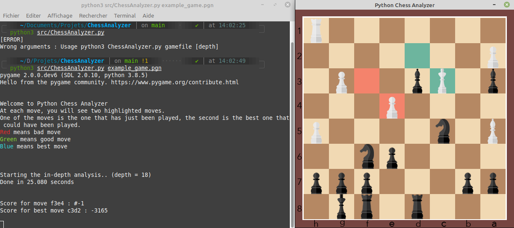

# ChessAnalyzer

An in-depth chess game analyzer written with Python 3 using Stockfish engine.

# Requirements
- [Pygame](https://pypi.org/project/pygame/)
- [Pythonchess](https://pypi.org/project/python-chess/)

Run `pip3 install -r requirements.txt`

# Usage 
Run `python3 src/ChessAnalyzer.py gamefile [b] [depth]`

- b means Black at the bottom. White otherwise.
- Default depth is 18.

Works with Windows, MacOs and Linux.

gamefile is :
- A PGN file (.pgn or .txt)
- A FEN (example: `python3 src/ChessAnalyzer.py "r1b1k1nr/pp3ppp/n3p3/2pp3q/3b3P/N3PNP1/P2B1P2/2RQKB1R b Kkq - 0 10"`)

# How it works
### PGN file
When you give the program a PGN file, it analyzes all the moves in the game, then you can review each move and see if it was the best one, a good one or an mistake.

### FEN
The program file show you the best move for this configuration

# Commands
- Press `r` to rotate the chess board
- Press `f` to print the actual FEN in the terminal
- Press `p` to print the score of the move and the score of the best one
- Press `q` or `esc` to quit

# Display example

On this screenshot, white has played fxe4, which is a mistake because it gives mate in one move for black.
The best move was Kd2 with a score of -3165.

# License
[GNU v3](https://choosealicense.com/licenses/gpl-3.0/)